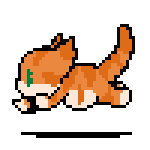

<h1 align="center">Whaly</h1>

 A lonely ginger cat.

<h2>🔥 Current Status</h2>

Whaly is going to be free discord music bot soon. 
**Adopt one now!** (Beta)
<code>https://pryter.me/whaly</code>

<h2>✨ Planned Features</h2>

- [X] Bot runtime  
- [X] Basic bot framework 
- [X] Play command 
- [X] Player controls 
- [X] Reconnect & Reload previous queue after user forced disconnect 
- [X] Interactive queue display 
- [X] Other utility commands 
    - Controls (seek, pause, skip, loop, ...) 
    - Shuffle 
    - <s>Some filters</s> 
- [X] Auto pause 
- [X] Global stats web page  
- [X] Internal web controller  
- [ ] Web Interface  
- [X] Play TOP-50 and TOP-100 command  

<h2>🧂 Description</h2>
Node v16.17 
Discord.js v14 
erela.js v2.4 
Lavalink Server 

<h2>🎨 Credits things</h2>
Inspired by: https://github.com/SudhanPlayz/Discord-MusicBot  
*Their bot is also awesome ! Don't foget to check them out.*
 
 
Animated icons by: 
https://icon-library.com/

 
 
 
Crafted with love 😻
